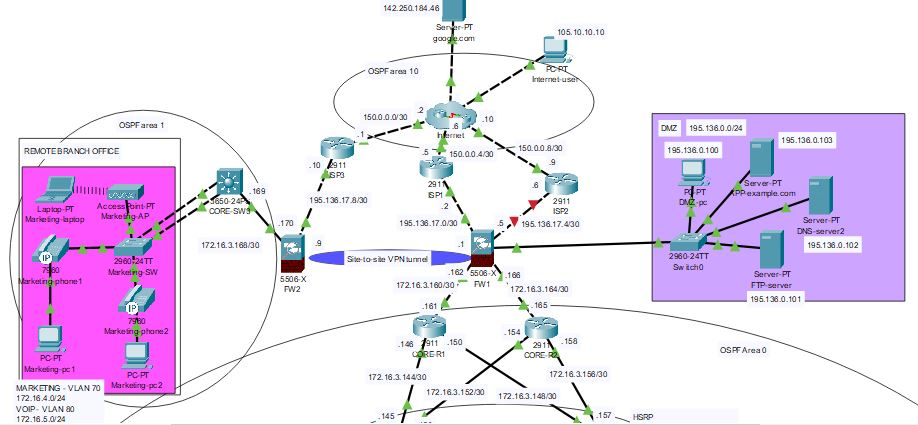
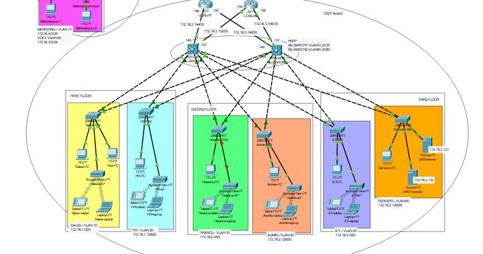

# Secure Company Network
Design and implementation of a secure, scalable enterprise network using **Cisco Packet Tracer**. Includes VLAN segmentation, routing, firewall rules, VPNs, and basic security measures to ensure network reliability and protection.

NOTE: The full Cisco Packet Tracer source file is available upon request to protect intellectual property. Please reach out at simone.bussa@libero.it if you'd like to review the full project.

---
## Overview
This project simulates a real-world business network. It covers the entire lifecycle of network design, addressing, device configuration, and security implementation.

Key goals of this project:
- Provide a **modular and scalable network design** for a medium-sized company 
- Demonstrate **routing, switching, and redundancy** best practices
- Implement basic **security measures**

  

  

---
## Features
- Multi-site company with a central three-floor headquarters and a remote branch office
- **VLAN Segmentation**: Departments segmented into VLANs (Sales, HR, Finance, Admin, ICT, Marketing, Voip) for improved security and performance
- **IPv4 Subnetting**: Structured addressing scheme
- **DHCP & DNS Services**: Centralized servers provide automatic IP allocation and domain name resolution
- **Dynamic Routing Protocols**: Multi-area OSPF is implemented to ensure optimal path selection and network scalability
- **Redundant Gateways**: Dual L3 switches configured with **HSRP** for gateway failover and load balancing
- **Wireless Access**: Autonomous APs for secure wireless connectivity

## Security features
- **Perimeter Firewalls**: Protect internal networks from external threats
- **Access Control Lists (ACLs)**: Access restrictions between VLANs and Internet resources
- **DMZ Implementation**: Isolated network segment for public-facing services (e.g., web-app server, ftp)
- **PAT configured on firewalls**: Network Address Translation for secure Internet access
- **Site-to-Site VPN**: Encrypted tunnel secures communication between the central site and remote office

## Additional features
- **Synchronized time**: NTP server provides accurate, synchronized time across all network devices
- **Logging and Monitoring**: Syslog Server centralizes logging collection and monitoring
- **Voip services**

---
## Repository Contents
This repository contains the following documentation:
- topology.pdf – High-level network topology diagram
- addressing-plan.txt - IPv4 subnetting and addressing scheme
- device-configs.txt - More detailed description of device configurations
- /images/ - Screenshots of Packet Tracer topology

